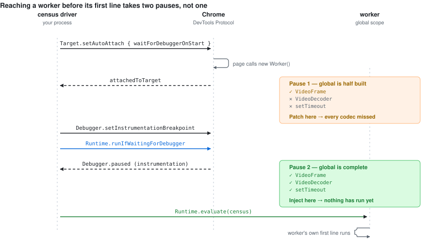

<div align="center">

# WebCodecs Census

[](https://www.npmjs.com/package/@motionvector/webcodecs-census)
[](https://github.com/motionvector-dev/webcodecs-census/actions/workflows/ci.yml)
[](https://bundlephobia.com/package/@motionvector/webcodecs-census)
[](https://docs.npmjs.com/generating-provenance-statements)
[](./LICENSE)

**Find leaked `VideoFrame`s, `AudioData` and codecs in a WebCodecs app — including inside Web Workers — and get the line of code that allocated them.**

[Why it's hard](#why-this-is-hard-and-why-it-didnt-exist) &nbsp;·&nbsp;
[Use from an agent](#use-it-from-an-agent) &nbsp;·&nbsp;
[Use in CI](#use-it-in-ci) &nbsp;·&nbsp;
[Extension](#browser-extension) &nbsp;·&nbsp;
[MCP server](#mcp-server)

</div>

WebCodecs objects hold resources from a finite pool outside the JS heap. The garbage collector never reclaims them; only `close()` does. Chrome's own guidance is blunt about the consequence: forget `frame.close()` and you leak GPU memory fast. But nothing in the platform tells you *that* you leaked one, *how many*, or *where from*. The app just gets slower, then quietly stops decoding.

DevTools' Media panel lists media players. It does not tell you which frames leaked or who allocated them. As far as we can find, nothing else does either.

<div align="center">
  <picture>
    <source media="(prefers-color-scheme: dark)" srcset="./docs/injection-dark.svg">
    
  </picture>
</div>

## Why this is hard, and why it didn't exist

Decoders almost always live in a Web Worker. Page-level monkey-patching — how [Spector.js](https://github.com/BabylonJS/Spector.js) and [WebGPU Inspector](https://github.com/brendan-duncan/webgpu_inspector) both work — cannot reach a worker the page created. That is the whole problem, and it has two teeth:

- A Manifest V3 `world: "MAIN"` content script at `document_start` is **not guaranteed** to run before the page's inline scripts.
- Rewriting `new Worker()` to load a shim from a blob URL **fails outright** on any site whose CSP omits `blob:` from `worker-src`/`script-src`.

Either failure is silent, and a leak detector that silently sees nothing reports a clean bill of health for an app that is losing every frame. That is worse than having no tool.

So the exact path uses the DevTools Protocol, and it needs **two** pauses, not one.

### The two-phase injection

`Target.setAutoAttach` with `waitForDebuggerOnStart` pauses a worker before its first line. Inject there and you catch an allocation on line 1. But at that moment a dedicated worker's global is only half built. Measured on Chrome 151:

| At the auto-attach pause | Present | Absent |
| --- | --- | --- |
| `VideoFrame`, `AudioData`, `ImageBitmap`, `EncodedVideoChunk` | ✅ | |
| `VideoDecoder`, `VideoEncoder`, `AudioDecoder`, `AudioEncoder` | | ❌ |
| `setInterval`, `setTimeout`, `queueMicrotask` | | ❌ |

Patch there and you instrument the frame types but miss **every codec** — most of what the tool is for. So we resume into a second, later pause: a `beforeScriptExecution` instrumentation breakpoint. That fires with the global fully populated and still before the worker's own script runs. It is the only moment that is both complete and early enough.

Auto-attach is not recursive, so each attached target arms it again for its children. That is what reaches nested workers.

### Decoded frames never pass through a constructor

The frames that leak in production are not the ones you build with `new VideoFrame()`. They are created by the platform and handed to the `output` callback you gave `new VideoDecoder({output})`. An instrument that only traps the constructor counts a handful of hand-built frames and misses the entire decode pipeline.

The census wraps the `output` callback at construction time. Because there are no application frames above a platform callback, a decoded frame is attributed to **the decoder that produced it** — which is the line you can actually act on. `.clone()` is tracked too: it returns an independent handle needing its own `close()`, and it also bypasses the constructor.

### Why not just take a heap snapshot?

Chrome's [DevTools MCP server](https://github.com/ChromeDevTools/chrome-devtools-mcp) gained heap-snapshot tools for agents in Chrome 151, which is the natural thing to reach for. It cannot answer this question, for three structural reasons rather than one fixable one.

Measured against this repo's own fixture, which leaks five `VideoFrame`s inside a worker:

| | Result |
| --- | --- |
| Heap snapshot of the page target | 4 `VideoFrame` nodes, **84 bytes** total |
| `webcodecs_census` | `VideoFrame: 5`, attributed to the decoder that produced them |

1. **Wrong heap.** A WebCodecs object's resource lives outside the JS heap — the entire reason `close()` exists. The snapshot is measuring JS wrappers, so it understates a frame holding megabytes of GPU memory as tens of bytes.
2. **Wrong scope.** The leak is in a worker, and a page-target snapshot does not cover worker isolates. You would have to snapshot every worker target separately and would still hit the first reason.
3. **Wrong question.** A frame collected by GC *without* `close()` is the most definitive leak there is, and it is gone from the heap by the time you could snapshot it. Only a `FinalizationRegistry` sees it, which is what this does.

The two compose rather than compete: several CDP clients can attach to one page at the same time, so an agent can run Chrome's DevTools MCP for JS-heap and performance work and this one for media object lifetimes.

## Install

```bash
npm install --save-dev @motionvector/webcodecs-census
```

## Use it from an agent

The point of this project. One call, structured output, no screenshots:

```js
import { attach, launchChrome } from '@motionvector/webcodecs-census-cdp';
import { summarize, checkLeaks } from '@motionvector/webcodecs-census';

const chrome = await launchChrome({ executablePath: CHROME });
const session = await attach({ browserURL: chrome.browserURL });
await session.navigate('http://localhost:5173/');

const censuses = await session.census();   // every context, page + workers
console.log(summarize(censuses));
```

```
2 context(s): main, worker
  main (3s): nothing live
  worker (3s): VideoDecoder=1 VideoFrame=5

5 VideoFrame still live (allowed 0).

Held by:
  5x VideoFrame (decoded, oldest 100ms) in worker
      at VideoSample.toVideoFrame (pipeline.js:17261:14)
      (frame emitted by this VideoDecoder)
```

### Who this is for

Anything decoding or encoding in the browser: timeline editors, recorders, transcoders, players that seek by decoding. [Clipchamp presented its WebCodecs pipeline at a W3C workshop](https://www.w3.org/2021/03/media-production-workshop/talks/slides/soeren-balko-clipchamp-webcodecs.pdf), and [Remotion has folded its media parser into mediabunny](https://www.remotion.dev/blog/mediabunny) and now recommends it. The more of your pipeline lives in a library, the more of it an app-only instrument cannot see.

### Works through libraries, not just your own code

If you use a WebCodecs toolkit like [mediabunny](https://github.com/Vanilagy/mediabunny), you never write `new VideoDecoder` — the library does. An instrument that only traps what *your* code constructs reports a clean bill of health for your entire pipeline.

The census patches the globals, and mediabunny references them at call time rather than capturing them at module scope, so everything it builds internally is counted. mediabunny also has a documented double-ownership rule that is easy to get wrong:

> The `VideoFrame` returned by this method **must** be closed separately from this video sample.

Close every `VideoSample` diligently, forget the frames, and you leak silently. Decoding ten frames through `VideoSampleSink` and closing half of them:

```
entered: {VideoFrame:constructed: 30, VideoEncoder:constructed: 1,
          VideoDecoder:constructed: 1, VideoFrame:decoded: 10}
left:    {VideoFrame:closed: 35, VideoEncoder:closed: 1, VideoDecoder:closed: 1}
live:    {VideoFrame: 5}

  5x VideoFrame (constructed, oldest 100ms)
     at _VideoSample.toVideoFrame (mediabunny-worker.js:17261:14)
     at decodeAndLeak (mediabunny-worker.js:26282:26)
```

The codecs mediabunny created are counted, and the leak is attributed to the exact method whose contract was broken. `test/mediabunny.test.mjs` builds a real MP4 with mediabunny, decodes it back through its own sinks, and asserts all of this.

### MCP server

```json
{
  "mcpServers": {
    "webcodecs-census": { "command": "npx", "args": ["-y", "@motionvector/webcodecs-census-mcp"] }
  }
}
```

Tools: `webcodecs_attach`, `webcodecs_census`, `webcodecs_leak_sites`, `webcodecs_timeline`, `webcodecs_evaluate`, `webcodecs_detach`. Output is kept small on purpose — a full census is mostly stack strings, which is not what you want filling an agent's context.

## Use it in CI

A leak becomes a test failure instead of something someone notices six months later:

```js
import { expectNoLeakedFrames } from '@motionvector/webcodecs-census';

test('the editor releases every frame it decodes', async () => {
  await playThroughTimeline();
  expectNoLeakedFrames(await session.census(), { minAgeMs: 1000 });
});
```

`checkLeaks()` returns the same information without throwing. `minAgeMs` ignores live objects younger than the threshold — a decode in flight is not a leak — and it decides the verdict, not just what the report prints. The census carries the age of every live object for exactly this reason.

`types` decides what counts as live too long, and defaults to the frame-like types — a long-lived decoder is normal, a long-lived frame almost never is. Pass `types: 'all'` to hold the codecs to the same standard. Whatever you pass, an object the GC collected while it was still open fails the check, and a type left out of `types` is named in the message rather than quietly reported clean:

```
No leaks in VideoFrame, AudioData, ImageBitmap — but VideoDecoder=47 still
live and not enforced. Pass types: 'all' to check those too.
```

## The timeline, and why a snapshot lies

A static count answers "how many are live". It cannot answer "was the pipeline busy when playback stalled" — and that difference matters. In the app this was built against, live decoder count did **not** predict failure: the highest count succeeded and lower counts stalled. A snapshot would have sent you after a resource-exhaustion bug that wasn't there.

So every context keeps a rolling sample of live counts, decode/encode throughput, codec queue depth, and every media element's `readyState`:

```js
webcodecs_timeline({ context: 'main', lastN: 20 })
```

```
   t(ms)  live          dec/out  queued  media(stalled)
   8000   VF=12         30/30    2       4(0)
   8250   VF=41         30/29    9       4(1)   <- stalled while decoding hard
   8500   VF=88         30/28    17      4(1)
```

Media elements are tracked because Chrome caps `WebMediaPlayer`s per frame (75 desktop, 40 mobile since Chrome 92). Past the cap, new elements stall at `readyState 0` / `networkState 2` with **no error event** — a failure with no signal attached to it.

## Browser extension

**Nothing is instrumented until you enable a specific site.** The extension ships
no host permissions and no declared content scripts; enabling a site requests
that one origin, registers a `document_start` content script for it, and
disabling hands the permission back. A leak tool has no business patching
WebCodecs on every page you visit.

Two modes, because the exact one is not free:

| | Patch mode | Exact mode |
| --- | --- | --- |
| Permissions | one origin, granted by you | that, plus `debugger` |
| Banner | none | "debugging this browser" |
| Works with DevTools open | yes | no |
| Workers started before the page script | missed | caught |
| Workers blocked by `worker-src` CSP | missed (reported) | caught |
| Codecs inside workers | caught | caught |

Patch mode never fails silently: whatever it could not wrap is listed in the
popup and in `problems[]` on the census.

```bash
npm run build:all      # then load extension/dist unpacked
```

## What it tracks

`VideoDecoder`, `VideoEncoder`, `AudioDecoder`, `AudioEncoder`, `VideoFrame`, `AudioData`, `ImageBitmap` — plus `<video>`/`<audio>` elements.

Each live object records how it entered the context:

| Origin | Meaning |
| --- | --- |
| `constructed` | `new VideoFrame(...)` here |
| `decoded` | produced by a codec, attributed to that codec's construction site |
| `cloned` | `.clone()` — an independent handle needing its own `close()` |
| `received` | arrived over `postMessage`; this context owns it now |

**Transfers are accounted for explicitly.** Transferring a `VideoFrame` detaches the sender's handle *without* calling `close()`, and the receiver gets it by structured clone rather than a constructor. Counted naively that is a false leak in the sender and an invisible object in the receiver. The census records a transfer as a distinct fate, and scans incoming messages (bounded depth) to adopt what arrives.

A `FinalizationRegistry` catches the unambiguous case: an object collected by GC that was never closed. That is a leak, not a heuristic.

## Security

The census patches global constructors, keeps allocation stacks in memory, and exposes `window.__webcodecsCensus` to anything in the page. The MCP server runs arbitrary JavaScript in the page under test, and CDP ports are unauthenticated by design. None of that is incidental — see [SECURITY.md](./SECURITY.md) for what is deliberate, what is not, and how to report a problem.

The core makes no network requests of any kind and has no runtime dependencies.

## Honest limits

- `EncodedVideoChunk`/`EncodedAudioChunk` have no `close()` and hold no external resource, so they are not tracked as leakable.
- Frames from `MediaStreamTrackProcessor` are not yet attributed; they are counted when closed or transferred.
- The message scanner walks 3 levels and 64 keys. A frame buried deeper arrives uncounted and shows up as `closedUnseen`.
- Patch mode changes `self.location` inside wrapped workers to the loader blob URL. Workers using `import.meta.url` are unaffected; workers building paths from `self.location` are not.
- Exact mode cannot share a tab with an open DevTools window. Chrome allows one debugger client.

## Development

```bash
npm install && npm run build:all && npm test
```

Tests drive a real Chrome and assert the things that would otherwise fail silently: that the shim beats a worker's first line, that decoded frames are counted, that a transferred frame is not blamed on the sender, and that patch mode really rewrites `Worker`.

### Releasing

All three packages share one version, because `-cdp` and `-mcp` depend on an
*exact* version of the core — bump one alone and you publish a package whose
dependency does not exist.

```bash
node scripts/version.mjs minor      # or patch / major / an explicit version
git commit -am "release: v0.2.0" && git tag v0.2.0
git push origin main --tags
```

The tag triggers `.github/workflows/release.yml`, which refuses a tag that does
not match the packages, runs the full browser suite against pinned Chrome, then
publishes all three in dependency order with npm provenance and opens a GitHub
Release using that version's `CHANGELOG.md` section, with the packed extension
attached.

**No npm token is involved.** Publishing authenticates with
[trusted publishing](https://docs.npmjs.com/trusted-publishers/) over OIDC:
short-lived, workflow-scoped credentials, nothing long-lived to leak or rotate,
and provenance generated automatically.

It has to be enabled once per package on npmjs.com, under *Settings → Trusted
publisher*:

| Field | Value |
| --- | --- |
| Organization or user | `motionvector-dev` |
| Repository | `webcodecs-census` |
| Workflow filename | `release.yml` |
| Environment | *(leave empty)* |

Two things it is easy to get wrong, both of which fail as a bare `ENEEDAUTH`:

- **Do not add `registry-url` to `actions/setup-node`.** It writes an
  `_authToken=` line into `.npmrc`, and with no token that line is empty — which
  npm reads as "authentication is configured", so it never starts the OIDC
  exchange at all.
- **npm 11.5.1 or later is required**, and Node 22 still ships npm 10. The
  workflow upgrades npm before publishing.

## Prior art

- [webgpu_inspector](https://github.com/brendan-duncan/webgpu_inspector) — excellent, actively maintained, and the quality bar for this project. Solves the analogous problem for WebGPU and ships a Claude Code plugin. Does not cover WebCodecs.
- [Spector.js](https://github.com/BabylonJS/Spector.js) — WebGL. Page-level patching, same worker blind spot.
- Chrome DevTools Media panel — lists players and logs; does not attribute frame lifetimes.
- [chrome-devtools-mcp](https://github.com/ChromeDevTools/chrome-devtools-mcp) — the official agent surface for DevTools. Strong at JS-heap leaks and performance; blind to resources held outside the JS heap. Runs alongside this one.

## Licence

MIT
